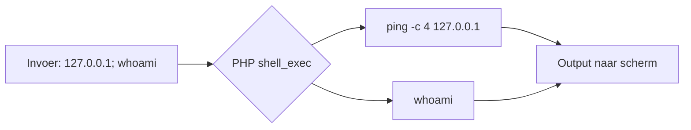

import LinuxTerminal from '@site/src/components/LinuxTerminal';

# Command Injection — Low

Voor **Command Injection** is het belangrijk dat we ons eerst verdiepen in het systeemcommando `ping`.

## 1. Predict (Voorspel)

Kijk eens naar de volgende (vereenvoudigde) code die wordt gebruikt om een IP-adres te pingen:

```php
$target = $_REQUEST[ 'ip' ];
$cmd = shell_exec( 'ping -c 4 ' . $target );
echo $cmd;
```

<details>
<summary>Hulp bij PHP syntax</summary>

- `shell_exec()`: Dit vertelt de webserver om een commando uit te voeren op het onderliggende besturingssysteem (Linux), alsof je het zelf in de terminal typt.
- `.` (punt): Plakt de variabele `$target` direct achter de tekst `ping -c 4 `.
</details>

**Vraag:** Wat denk je dat dit script doet als een gebruiker de volgende tekst invult bij het IP-adres: `127.0.0.1; whoami`?

<details>
<summary>Antwoord</summary>

De variabele `$target` wordt letterlijk in het commando geplakt. Het uiteindelijke commando wordt dan: `ping -c 4 127.0.0.1; whoami`. 

In een schema ziet de injectie er zo uit:



In Linux betekent de puntkomma (`;`) dat het eerste commando wordt afgesloten en een nieuw commando begint. Het script pingt dus eerst zichzelf en voert daarna het `whoami` commando uit, wat de huidige gebruiker van de server toont.
</details>

## 2. Run (Uitvoeren)

Tijd om dit te testen in de praktijk.

1. Start `DVWA` in je Kali-omgeving en ga in je browser naar de challenge `Command Injection`.
2. Zorg dat je `DVWA Security` op **low** hebt staan. (Vergeten hoe dit moet? Ga dan naar de [cheatsheet](../../docs/cheatsheet)).
3. Vul een IP-adres in (bijvoorbeeld `127.0.0.1`) en bekijk de output.

## 3. Investigate (Onderzoeken)

Je hebt zojuist succesvol gepingd. Maar we zijn hier om te hacken. 

**Vraag:** Hoe kun je in een Linux-terminal twee afzonderlijke commando's op exact dezelfde regel achter elkaar uitvoeren?

<details>
<summary>Tip</summary>

Kijk op je [Cheatsheet](../../docs/cheatsheet) onder "Linux Commando's". Er is een specifiek leesteken dat als "scheidingsteken" werkt.
</details>

<details>
<summary>Antwoord</summary>

Je kunt de puntkomma (`;`) of de dubbele ampersand (`&&`) gebruiken. Bijvoorbeeld: `commando1 ; commando2`.
</details>

## 4. Modify & Make (Aanpassen & Maken)

Bedenk nu een invoer in het DVWA invulveld die start met een IP-adres, waardoor het originele `ping`-commando slaagt, en er daarna direct een **tweede Linux-commando** (zoals `ls` of `whoami`) wordt uitgevoerd door de webserver.

<details>
<summary>Tip</summary>

De webserver plakt jouw invoer achter het woord `ping`. Als jij `127.0.0.1; ls` typt, voert de server `ping 127.0.0.1; ls` uit.
</details>

<details>
<summary>Antwoord</summary>

Vul in: `127.0.0.1; ls`
Het resultaat van een succesvolle poging (je ziet de bestanden van de server!) zie je hieronder:


</details>

## 5. ✓ Wat moest je zien?

:::tip Controle
- Het normale `ping`-resultaat (4 regels met `64 bytes from 127.0.0.1: ...`) verschijnt in de output.
- Direct daaronder zie je de **uitvoer van je tweede commando** — bij `ls` is dat een lijstje bestandsnamen (zoals `help`, `index.php`, `source`); bij `whoami` zie je `www-data`.
- In het invoerveld stond letterlijk `127.0.0.1; ls` (of `&&`), niet alleen het IP.

Krijg je alleen het ping-resultaat en verder niets? Dan is je puntkomma weggevallen. Plak je payload opnieuw en let op dat hij begint met een geldig IP, gevolgd door `;` of `&&`.
:::

## 6. Er gaat iets mis...

Wat gebeurt er als je alleen `; ls` invult (zonder IP adres ervoor)?
Je krijgt waarschijnlijk een melding zoals `ping: usage error`. Omdat de linkerkant van de puntkomma niet klopt (een ping zonder adres), mislukt de ping. Echter, in Linux wordt het commando áchter de puntkomma vaak tóch uitgevoerd! Bij gebruik van `&&` stopt Linux wél direct als het eerste deel faalt.

### Oefen met de terminal

Probeer command injection uit in de gesimuleerde terminal hieronder:
- `ping 127.0.0.1` — normaal ping-commando
- `ping 127.0.0.1; cat /etc/passwd` — command injection met `;`
- `ping 127.0.0.1 && whoami` — command injection met `&&`

<LinuxTerminal title="Command Injection — Low (geen filter)" />

## Walkthrough

Kom je er niet uit? Bekijk dan deze walkthrough:

<iframe width="920" height="517" src="https://www.youtube.com/embed/WiqRvlN_UIU?start=9" title="2 - Command Injection (low/med/high) - Damn Vulnerable Web Application (DVWA)" frameborder="0" allow="accelerometer; autoplay; clipboard-write; encrypted-media; gyroscope; picture-in-picture; web-share" referrerpolicy="strict-origin-when-cross-origin" allowfullscreen></iframe>
