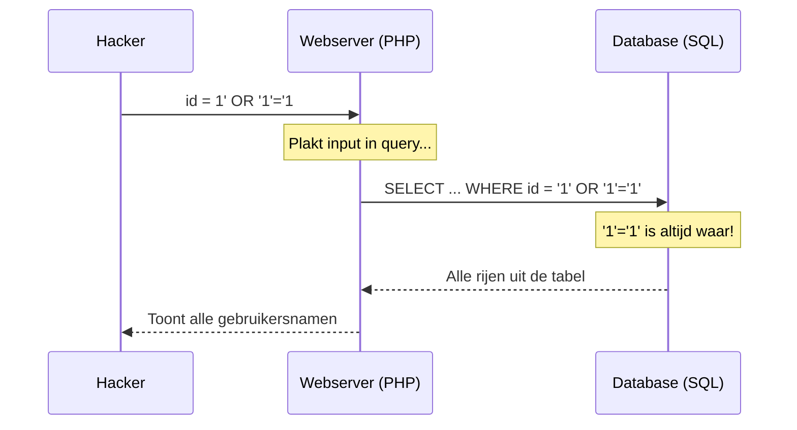

import DvwaLab from '@site/src/components/DvwaLab';

# SQL Injection — Low

Welkom bij SQL Injection. We gaan leren hoe we de database van een applicatie kunnen manipuleren.

## 1. Predict (Voorspel)

Kijk naar deze (vereenvoudigde) code die zoekt naar een gebruiker op basis van een ID:

```php
$id = $_REQUEST[ 'id' ];
$query  = "SELECT first_name, last_name FROM users WHERE user_id = '$id';";
```

<details>
<summary>Hulp bij PHP syntax</summary>

- `$_REQUEST['id']`: Dit haalt de tekst op die de gebruiker in het invoerveld heeft getypt.
- `.` (punt): In PHP worden teksten aan elkaar geplakt met een punt. Hier wordt de `$id` letterlijk tussen de aanhalingstekens van de query geplakt.
- `$query`: Een variabele die de SQL-opdracht bevat die naar de database wordt gestuurd.
</details>

**Vraag:** Wat denk je dat het uiteindelijke database-commando wordt als de gebruiker de volgende vreemde tekst invult als ID: `1' OR '1'='1`?

<details>
<summary>Antwoord</summary>

De ingevulde tekst wordt rechtstreeks in de query geplakt. De query wordt dan:
`SELECT first_name, last_name FROM users WHERE user_id = '1' OR '1'='1';`

In een schema ziet die aanval er zo uit:



Omdat 1 altijd gelijk is aan 1, is de stelling `OR '1'='1'` altijd WAAR. De database negeert het specifieke ID en geeft doodleuk **alle** gebruikers in de hele tabel terug!
</details>

## 2. Run & Investigate

Start het lab hieronder op **Low**.

<DvwaLab module="sql_injection" level="low" />

Vul in het veld eerst een normaal getal in (bijv. `1`). Je ziet de gegevens van één gebruiker. 
Klik nu op "Bekijk broncode" om te zien of de invoer gefilterd wordt.

## 3. Modify & Make (Aanpassen & Maken)

Probeer nu de kwetsbaarheid (de ontbrekende filter) te misbruiken. Jouw doel is om met één druk op de knop **alle** gebruikers in de database op je scherm te toveren, in plaats van slechts één.

<details>
<summary>Tip</summary>

Gebruik het antwoord uit de Predict-fase. Let goed op het gebruik van enkele aanhalingstekens (`'`) om uit te breken.
</details>

<details>
<summary>Antwoord</summary>

Vul exact dit in: `1' OR '1'='1` en klik op Submit. Soms vereist de database dat je de rest van de query (als die er zou zijn) 'uitcommentarieert'. Dan gebruik je: `1' OR '1'='1' #`
</details>

## 4. ✓ Wat moest je zien?

:::tip Controle
- Een lijst met **álle 5 gebruikers** (Voornaam + Achternaam), niet slechts één.
- Geen SQL-foutmelding (rode balk).
- In de URL of POST-body staat jouw payload (`1' OR '1'='1`) als ID.

Komt dit niet overeen? Controleer dat je exact `1' OR '1'='1` typte (let op de enkele aanhalingstekens) en dat je op **Submit** klikt na het invullen.
:::

## 5. Er gaat iets mis...

Als je per ongeluk `1" OR "1"="1` typt (met dubbele in plaats van enkele aanhalingstekens), krijg je misschien een lelijke SQL Syntax Error op je scherm. 
Dit komt omdat de database string-waardes verwacht in enkele aanhalingstekens. Hackers zijn stiekem héél blij met dit soort foutmeldingen! Een error verraadt namelijk dat de applicatie kwetsbaar is voor SQL Injection. Bovendien verklapt de foutmelding vaak exact welke database (MySQL, PostgreSQL) er op de achtergrond draait.
